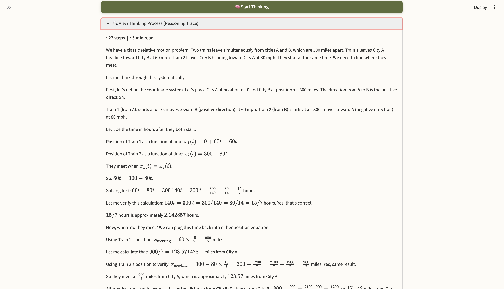
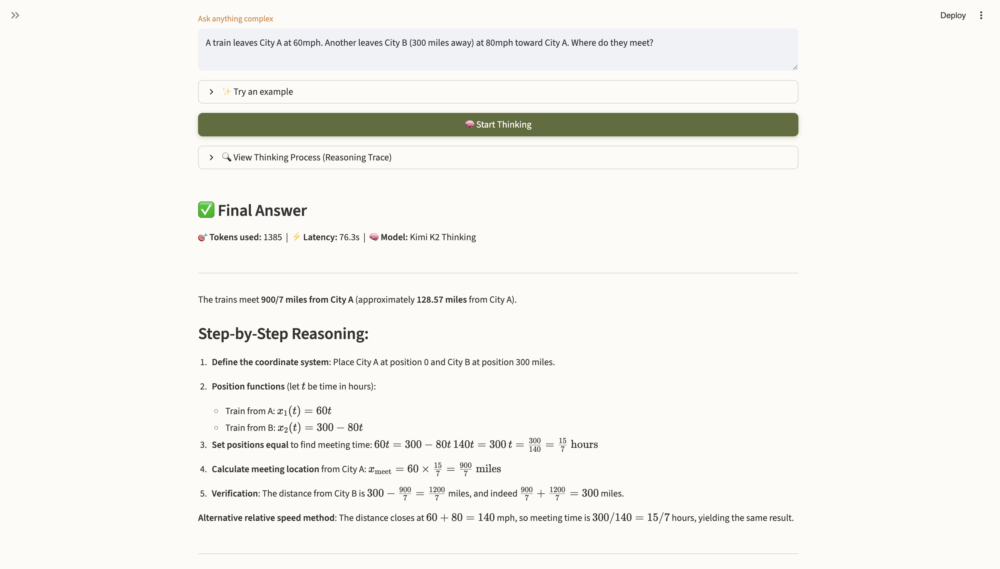
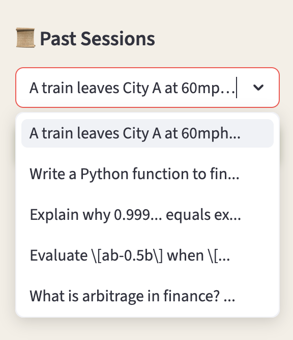

<div align="center">


# ThinkTrace AI 🧠

**Watch AI Think.**
Ask any hard question. See every step of the reasoning — not just the answer.

<br>

[](https://www.python.org/)
[](https://streamlit.io/)
[](https://moonshot.cn/)
[](https://qubrid.com)
[](LICENSE)

</div>

---

## What it does

ThinkTrace AI makes the invisible visible. Most AI apps hide the thinking and hand you a final answer. ThinkTrace surfaces the entire reasoning chain — every assumption, every intermediate step, every self-correction — using Kimi K2 Thinking's native `reasoning_content` field, routed through [Qubrid AI](https://qubrid.com) infrastructure.

- **Full Reasoning Trace** — see the model's complete chain-of-thought before the answer.
- **LaTeX Rendering** — math proofs and equations display beautifully inline.
- **Persistent Session History** — every question is saved and reloadable from the sidebar.
- **One-Click Examples** — curated starters across math, logic, science, and coding.
- **PDF Report Download** — export any answer as a shareable report.

Powered by **Kimi K2 Thinking** (Moonshot AI) via [Qubrid AI](https://qubrid.com).

---

## 📸 Screenshots

### 🏠 Clean Interface + Example Questions


*Minimal, centred interface. Expand the examples panel to load a starter question in one click — from formal math proofs to logic puzzles and coding challenges.*

---

### 🔍 Reasoning Trace — Step by Step


*The full chain-of-thought unfolds before the answer. Every assumption, intermediate calculation, and self-verification is visible — with LaTeX math rendered inline.*

---

### ✅ Final Answer


*Beautifully formatted final answer with full LaTeX math, token count, latency, and model info. Download the full report as a file.*

---

### 📚 Session History Sidebar


*All past sessions are saved automatically to a local SQLite database. Load any previous question and answer in one click — or start fresh with New Chat.*

---

## ✨ Features

- **🧠 Transparent Reasoning** — Kimi K2 Thinking's full chain-of-thought, not just the output.
- **📐 LaTeX Math** — inline and block equations rendered natively.
- **📚 Full Session History** — load or delete any past session from the sidebar.
- **✏️ New Chat** — clear the workspace and start fresh in one click.
- **💡 Example Questions** — curated starters across 6 subject areas.
- **📄 Report Download** — export any answer as a formatted file.
- **⚡ Token + Latency Stats** — see exactly how much compute each answer used.

---

## 🎯 How It Works

1. **Ask** → Type any complex question (or pick an example).
2. **Think** → Kimi K2 Thinking reasons through the problem step by step.
3. **Trace** → Expand "View Thinking Process" to see the full reasoning chain.
4. **Answer** → The verified final answer is rendered below with LaTeX formatting.
5. **Save** → The session is automatically saved — reload it any time from the sidebar.

---

## 📊 Supported Question Types

| Category | Examples |
|----------|---------|
| 🧮 Mathematics | Proofs, algebra, calculus, combinatorics |
| 🧠 Logic & Puzzles | Riddles, constraint problems, lateral thinking |
| 🔬 Science | Physics, chemistry, biology questions |
| 💻 Coding | Algorithm design, complexity analysis, debugging |
| 📊 Data & Statistics | Probability, distributions, hypothesis testing |
| 💡 General Reasoning | Thought experiments, philosophy, inference |


---

## 💡 What Makes This Different

Most AI apps treat reasoning as an internal detail — you get the answer and nothing else. ThinkTrace AI treats **the reasoning trace as the product**. Every question returns two things:

1. The full chain-of-thought — every assumption, dead-end, and correction the model made.
2. The final verified answer — formatted, math-rendered, and ready to download.

This is especially useful for learning: you don't just see *that* `0.999... = 1`, you see *why*, proved from first principles, step by step.

---

## 📁 Project Structure

```
thinktrace-ai/
├── app.py                    # Main Streamlit application
├── frontend/
│   ├── __init__.py
│   ├── components.py         # UI components (header, input, answer card, sidebar)
│   ├── styles.py             # Global custom CSS
│   └── assets/               # Screenshots and logo
├── backend/
│   ├── __init__.py
│   ├── api_client.py         # Kimi K2 Thinking API integration via Qubrid
│   ├── db.py                 # SQLite session persistence
│   └── parser.py             # Reasoning/answer cleaning and formatting
├── config/
│   ├── __init__.py
│   └── settings.py           # Model config, prompts, categories
├── .env.example              # API key template
├── .gitignore
├── pyproject.toml            # UV dependency management
└── README.md
```

---

## 🛠️ Tech Stack

| Layer | Technology |
|-------|-----------|
| UI Framework | Streamlit + Custom CSS |
| Reasoning Model | Kimi K2 Thinking (`moonshotai/Kimi-K2-Thinking`) |
| API Infrastructure | [Qubrid AI](https://platform.qubrid.com) |
| Math Rendering | LaTeX via Streamlit native |
| Database | SQLite3 |
| Dependency Management | `uv` |

---

## 🚀 Quick Start

### Prerequisites

- Python 3.10+
- A [Qubrid AI](https://platform.qubrid.com) API key
- `uv` package manager (recommended)

### Installation

```bash
# 1. Clone repository
git clone https://github.com/aryadoshii/thinktrace-ai.git
cd thinktrace-ai

# 2. Install UV package manager
curl -LsSf https://astral.sh/uv/install.sh | sh
source ~/.zshrc

# 3. Create and activate virtual environment
uv venv
source .venv/bin/activate  # macOS/Linux

# 4. Install dependencies
uv sync

# 5. Set up API key
cp .env.example .env
nano .env  # Add your QUBRID_API_KEY

# 6. Run the app
streamlit run app.py
```

---

<div align="center">

**Made with ❤️ by Qubrid AI**

</div>
